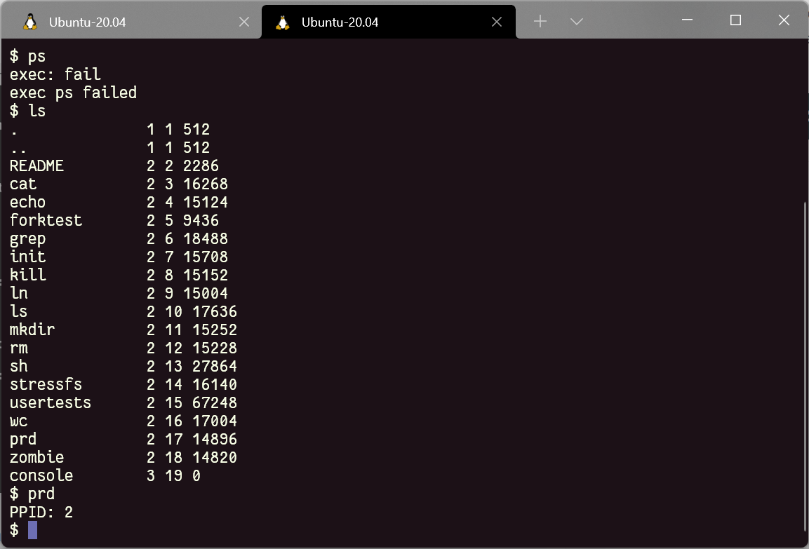
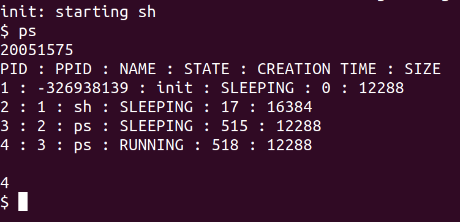
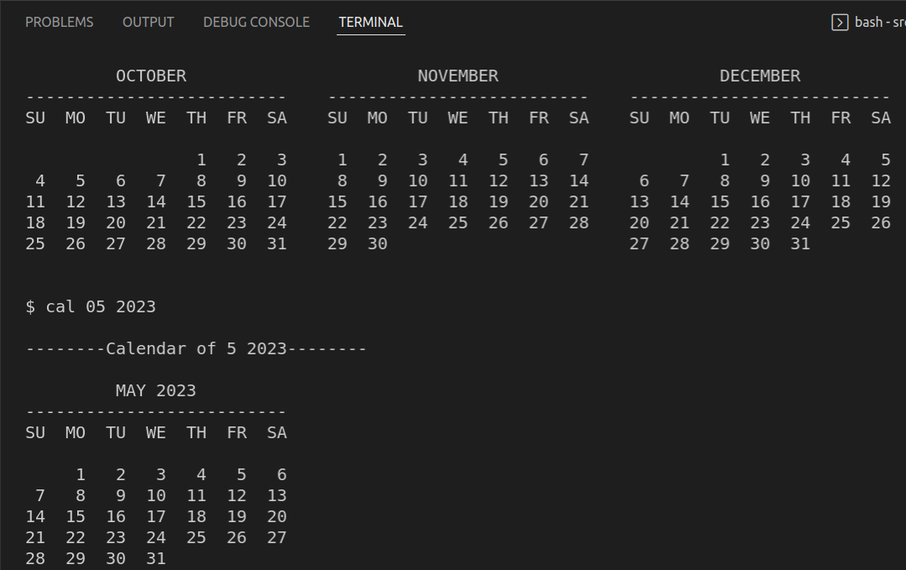
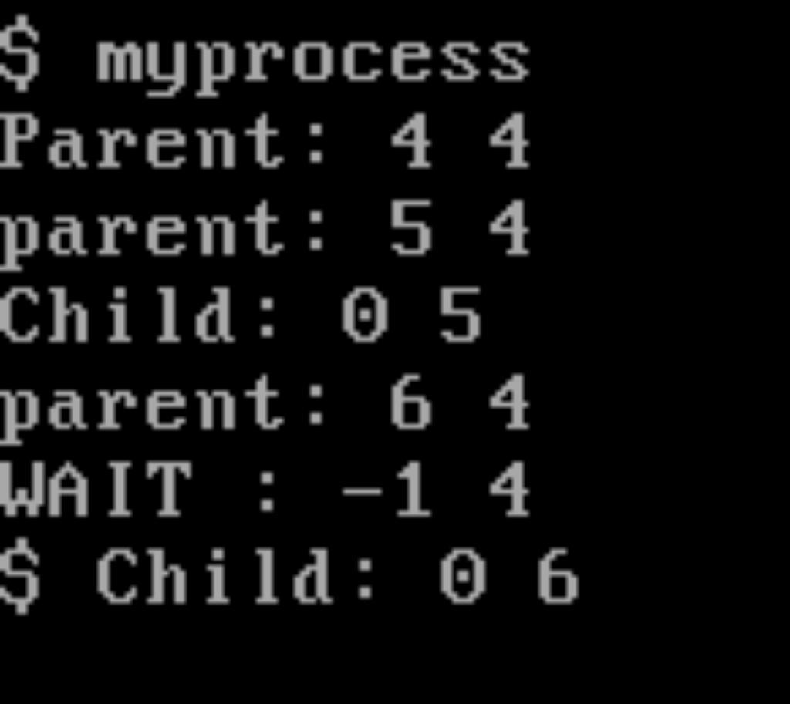

# Group no 7

OS-assignment CSE 3

[`Github_Link`](https://github.com/dipankardas011/OS-Assignment)

Submitted to: Sir Amulya Ratna Swain

## Grp-members

- `02005006`    *Ahana Bose*
- `02005035`    *Manav singh*
- `02005731`    *Kaustav Sharma*
- `20051550`    *Nivedita Sutradhar*
- `20051551`    *Pranshul Goyal*
- `20051554`    *Dipankar Das*
- `20051575`    *Rohit Ryan*
- `20051588`    *Shivansh Chaubey*
- `20051446`    *Shagun Kumar*

### Q1
- [x] Dipankar Das
- [x] Shagun Kumar

### Q2
- [x] Rohit Ryan
- [x] Shivansh Chaubey
- [x] Ahana Bose

### Q3
- [x] Nivedita Sutradhar
- [x] Pranshul Goyal

### Q4
- [x] Kaustav Sharma
- [x] Manav singh

## STEPS, CODE & OUTPUT

### Q1
Create a system call called getppid() and create a command called "prd" where you need to
display the process-id along with parent process-id. (use the help of getpid)

```diff
commit 69b71590da646d666d7d3e2df2e4069706051ce1
Author: DipankarDas <dipsonu10@hotmail.com>
Date:   Thu Feb 10 15:44:12 2022 +0530

  	Testing Done Q1✅ ready to be merge
    
    Signed-off-by: DipankarDas <dipsonu10@hotmail.com>, Shagun Kumar <20051446@kiit.ac.in>

diff --git a/src/Makefile b/src/Makefile
index 09d790c..d1c1b2b 100644
--- a/src/Makefile
+++ b/src/Makefile
@@ -180,6 +180,7 @@ UPROGS=\
 	_stressfs\
 	_usertests\
 	_wc\
+	_prd\
 	_zombie\
 
 fs.img: mkfs README $(UPROGS)
@@ -249,7 +250,7 @@ qemu-nox-gdb: fs.img xv6.img .gdbinit
 
 EXTRA=\
 	mkfs.c ulib.c user.h cat.c echo.c forktest.c grep.c kill.c\
-	ln.c ls.c mkdir.c rm.c stressfs.c usertests.c wc.c zombie.c\
+	ln.c ls.c mkdir.c rm.c stressfs.c usertests.c wc.c prd.c zombie.c\
 	printf.c umalloc.c\
 	README dot-bochsrc *.pl toc.* runoff runoff1 runoff.list\
 	.gdbinit.tmpl gdbutil\
diff --git a/src/defs.h b/src/defs.h
index 82fb982..d339727 100644
--- a/src/defs.h
+++ b/src/defs.h
@@ -120,6 +120,7 @@ void            userinit(void);
 int             wait(void);
 void            wakeup(void*);
 void            yield(void);
+int             getppid(void);
 
 // swtch.S
 void            swtch(struct context**, struct context*);
diff --git a/src/prd.c b/src/prd.c
new file mode 100644
index 0000000..f3c5e25
--- /dev/null
+++ b/src/prd.c
@@ -0,0 +1,12 @@
+#include "types.h"
+#include "stat.h"
+#include "user.h"
+#include "fcntl.h"
+
+int
+main(int argc, char *argv[])
+{
+  printf(1, "PPID: %d\n", getppid());
+
+  exit();
+}
diff --git a/src/proc.c b/src/proc.c
index 806b1b1..d67a73f 100644
--- a/src/proc.c
+++ b/src/proc.c
@@ -532,3 +532,13 @@ procdump(void)
     cprintf("\n");
   }
 }
+
+int
+getppid()
+{
+  return myproc()->parent->pid;
+}
diff --git a/src/syscall.c b/src/syscall.c
index ee85261..f3d74af 100644
--- a/src/syscall.c
+++ b/src/syscall.c
@@ -103,6 +103,7 @@ extern int sys_unlink(void);
 extern int sys_wait(void);
 extern int sys_write(void);
 extern int sys_uptime(void);
+extern int sys_getppid(void);
 
 static int (*syscalls[])(void) = {
 [SYS_fork]    sys_fork,
@@ -126,6 +127,7 @@ static int (*syscalls[])(void) = {
 [SYS_link]    sys_link,
 [SYS_mkdir]   sys_mkdir,
 [SYS_close]   sys_close,
+[SYS_getppid] sys_getppid,
 };
 
 void
diff --git a/src/syscall.h b/src/syscall.h
index bc5f356..68d3a70 100644
--- a/src/syscall.h
+++ b/src/syscall.h
@@ -1,22 +1,24 @@
 // System call numbers
 #define SYS_close  21
+#define SYS_getppid 22
+
diff --git a/src/sysproc.c b/src/sysproc.c
index 0686d29..d2c3de7 100644
--- a/src/sysproc.c
+++ b/src/sysproc.c
@@ -42,6 +42,18 @@ sys_getpid(void)
   return myproc()->pid;
 }
 
+
+int
+sys_getppid(void)
+{
+  return getppid();
+  //return myproc()->parent->id;
+}
+
+
 int
 sys_sbrk(void)
 {
@@ -89,3 +101,4 @@ sys_uptime(void)
   release(&tickslock);
   return xticks;
 }
diff --git a/src/user.h b/src/user.h
index 4f99c52..0fbbd35 100644
--- a/src/user.h
+++ b/src/user.h
@@ -23,6 +23,7 @@ int getpid(void);
 char* sbrk(int);
 int sleep(int);
 int uptime(void);
+int getppid(void);
 
 // ulib.c
 int stat(const char*, struct stat*);
diff --git a/src/usys.S b/src/usys.S
index 8bfd8a1..1794316 100644
--- a/src/usys.S
+++ b/src/usys.S
@@ -29,3 +29,5 @@ SYSCALL(getpid)
 SYSCALL(sbrk)
 SYSCALL(sleep)
 SYSCALL(uptime)
+
+SYSCALL(getppid)
\ No newline at end of file
```


 
### Q2
Create a ps command that will display the following. You need to prepare a system call
called sps(system processes) that will provide the following information.
PID, PPID, Process name, process state
then you try to display the following
Your roll no, PID, PPID, Process name, process state, process creation time, size of
process memory

```diff
commit 69b71590da646d666d7d3e2d34534f2e40697060541ce1
Author: Rohit <20051575@kiit.ac.in>
Date:   Thu Feb 14 15:44:12 2022 +0530

    Testing Done Q2✅ ready to be merge
    
    Signed-off-by: Rohit <20051575@kiit.ac.in>, Shivansh Chaubey <20051588@kiit.ac.in>, Ahana Bose <2005006@kiit.ac.in>


diff --git a/src/Makefile b/src/Makefile
index d1c1b2b..955bc64 100644
--- a/src/Makefile
+++ b/src/Makefile
@@ -181,6 +181,7 @@ UPROGS=\
 	_usertests\
 	_wc\
 	_prd\
+	_ps\
 	_zombie\
 
 fs.img: mkfs README $(UPROGS)
diff --git a/src/defs.h b/src/defs.h
index d339727..b330737 100644
--- a/src/defs.h
+++ b/src/defs.h
@@ -121,7 +121,7 @@ int             wait(void);
 void            wakeup(void*);
 void            yield(void);
 int             getppid(void);
-
+int		sps(void);
 // swtch.S
 void            swtch(struct context**, struct context*);
 
diff --git a/src/proc.c b/src/proc.c
index 188ab56..6a5a33d 100644
--- a/src/proc.c
+++ b/src/proc.c
@@ -111,6 +111,7 @@ found:
   p->context = (struct context*)sp;
   memset(p->context, 0, sizeof *p->context);
   p->context->eip = (uint)forkret;
+  p->cr_time = ticks;//Process creation time
 
   return p;
 }
@@ -138,6 +139,7 @@ userinit(void)
   p->tf->eflags = FL_IF;
   p->tf->esp = PGSIZE;
   p->tf->eip = 0;  // beginning of initcode.S
+  p->cr_time = ticks; //Process creation time
 
   safestrcpy(p->name, "initcode", sizeof(p->name));
   p->cwd = namei("/");
@@ -538,3 +540,26 @@ getppid()
 {
   return myproc()->parent->pid;
 }
+
+int
+sys_sps(void)
+{
+        struct proc *p;
+        sti();
+        acquire(&ptable.lock);
+        cprintf("PID : PPID : NAME : STATE : CREATION TIME : SIZE\n");
+        for(p = ptable.proc; p<&ptable.proc[NPROC]; p++)
+        {
+         if(p->state == SLEEPING)
+         cprintf("%d : %d : %s : SLEEPING : %d : %d\n",p->pid,p->parent->pid,p->name,p->cr_time,p->sz);
+         else if(p->state == RUNNING)
+         cprintf("%d : %d : %s : RUNNING : %d : %d\n",p->pid,p->parent->pid,p->name,p->cr_time,p->sz);
+         else if (p->state == RUNNABLE)
+         cprintf("%d : %d : %s : RUNNABLE : %d : %d\n",p->pid,p->parent->pid,p->name,p->cr_time,p->sz);
+        }
+        release(&ptable.lock);
+        return 0;
+
+}
+
+
diff --git a/src/proc.h b/src/proc.h
index 1647114..c1b2d56 100644
--- a/src/proc.h
+++ b/src/proc.h
@@ -49,6 +49,7 @@ struct proc {
   struct file *ofile[NOFILE];  // Open files
   struct inode *cwd;           // Current directory
   char name[16];               // Process name (debugging)
+  int cr_time;	 	       //Process creation time
 };
 
 // Process memory is laid out contiguously, low addresses first:
diff --git a/src/syscall.c b/src/syscall.c
index f3d74af..4cd9612 100644
--- a/src/syscall.c
+++ b/src/syscall.c
@@ -104,6 +104,7 @@ extern int sys_wait(void);
 extern int sys_write(void);
 extern int sys_uptime(void);
 extern int sys_getppid(void);
+extern int sys_sps(void);
 
 static int (*syscalls[])(void) = {
 [SYS_fork]    sys_fork,
@@ -128,6 +129,7 @@ static int (*syscalls[])(void) = {
 [SYS_mkdir]   sys_mkdir,
 [SYS_close]   sys_close,
 [SYS_getppid] sys_getppid,
+[SYS_sps]     sys_sps,
 };
 
 void
diff --git a/src/syscall.h b/src/syscall.h
index 68d3a70..d2d236e 100644
--- a/src/syscall.h
+++ b/src/syscall.h
@@ -21,4 +21,4 @@
 #define SYS_mkdir   20
 #define SYS_close   21
 #define SYS_getppid 22
-
+#define SYS_sps	    23
diff --git a/src/user.h b/src/user.h
index 0fbbd35..c899602 100644
--- a/src/user.h
+++ b/src/user.h
@@ -24,6 +24,7 @@ char* sbrk(int);
 int sleep(int);
 int uptime(void);
 int getppid(void);
+int sps(void);
 
 // ulib.c
 int stat(const char*, struct stat*);
diff --git a/src/usys.S b/src/usys.S
index 1794316..b14f7be 100644
--- a/src/usys.S
+++ b/src/usys.S
@@ -31,3 +31,4 @@ SYSCALL(sleep)
 SYSCALL(uptime)
 
 SYSCALL(getppid)
+SYSCALL(sps)

```




### Q3
Create a cal command with different options as specified in Unix manual.

```diff
commit c389e7250f916026c64eba096d1ad659c728f9d5
Author: pranshul <pranshul.hs@gmail.com>
Date:   Tue Feb 15 17:34:34 2022 +0530

    q3 done. Only left is patch.
    
    Signed-off-by: pranshul <pranshul.hs@gmail.com>, Nivedita Sutradhar <20051550>

diff --git a/output/q3.png b/output/q3.png
new file mode 100644
index 0000000..a2b1918
Binary files /dev/null and b/output/q3.png differ
diff --git a/src/Makefile b/src/Makefile
index 955bc64..d61ea40 100644
--- a/src/Makefile
+++ b/src/Makefile
@@ -183,6 +183,7 @@ UPROGS=\
 	_prd\
 	_ps\
 	_zombie\
+	_cal\
 
 fs.img: mkfs README $(UPROGS)
 	./mkfs fs.img README $(UPROGS)
diff --git a/src/cal.c b/src/cal.c
new file mode 100644
index 0000000..4b7f614
--- /dev/null
+++ b/src/cal.c
@@ -0,0 +1,459 @@
+#include "types.h"
+#include "stat.h"
+#include "user.h"
+#include "fcntl.h"
+
+void display_month_row(int *m_cday, int *m_cdate, int no_days_month)
+{
+    for (int space = 1; space < (*m_cday); space++)
+        printf(1,"    ");
+    while (((*m_cday) != 8) && ((*m_cdate) <= no_days_month))
+    {
+    	if((*m_cdate) < 10)
+    		printf(1," %d", (*m_cdate));
+    	else
+        	printf(1,"%d", (*m_cdate));
+        (*m_cdate)++;
+        (*m_cday)++;
+        if ((*m_cday) < 8)
+            printf(1,"  ");
+    }
+    if ((*m_cday) == 8)
+        (*m_cday) = 1;
+    else if ((*m_cdate) == (no_days_month + 1))
+    {
+        while ((*m_cday) < 8)
+        {
+            printf(1,"  ");
+            (*m_cday)++;
+            if ((*m_cday) < 8)
+                printf(1,"  ");
+        }
+        (*m_cday) = 1;
+    }
+}
+
+int no_days_month(int month, int year)
+{
+    switch(month)
+    {
+        case 1:
+        case 3:
+        case 5:
+        case 7:
+        case 8:
+        case 10:
+        case 12:
+            return 31;
+        case 2:
+            if(((year % 400) == 0) || (((year % 4) == 0) && ((year % 100) !=0)))
+                return 29;
+            else
+                return 28;
+        case 4:
+        case 6:
+        case 9:
+        case 11:
+            return 30;
+    }
+    return 0;
+}
+
+int day1_mm_yyyy(int mm, int yyyy)
+{
+    int day1;
+
+    day1 = ((yyyy % 100)/4)+1;
+
+    switch (mm)
+    {
+        case 1:
+        case 10:
+            day1 += 1;
+            break;
+        case 2:
+        case 3:
+        case 11:
+            day1 += 4;
+            break;
+        case 5:
+            day1 += 2;
+            break;
+        case 6:
+            day1 += 5;
+            break;
+        case 8:
+            day1 += 3;
+            break;
+        case 9:
+        case 12:
+            day1 += 6;
+            break;
+    }
+
+    if(((yyyy % 400) == 0) || (((yyyy % 4) == 0) && ((yyyy % 100) !=0)))
+    {
+        if((mm == 1) || (mm == 2))
+            day1 -= 1;
+    }
+
+    int temp_yy = yyyy;
+    if(temp_yy < 1700)
+        while(temp_yy < 1700)
+            temp_yy += 400;
+    else if(temp_yy > 2099)
+        while(temp_yy > 2099)
+            temp_yy -= 400;
+
+    if(temp_yy < 1800)
+        day1 += 4;
+    else if(temp_yy < 1900)
+        day1 += 2;
+    else if(temp_yy >= 2000)
+        day1 += 6;
+    
+    day1 += (yyyy % 100);
+    day1 %= 7;
+
+    switch (day1)
+    {
+        case 1:
+            return 1;
+            break;
+        case 2:
+            return 2;
+            break;
+        case 3:
+            return 3;
+            break;
+        case 4:
+            return 4;
+            break;
+        case 5:
+            return 5;
+            break;
+        case 6:
+            return 6;
+            break;
+        case 0:
+            return 7;
+            break;
+    }
+    return 0;
+}
+
+void display_yyyy_cal(int yyyy)
+{
+    for(int month = 1; month < 12;)
+    {
+        //display month names
+        switch(month)
+        {
+            case 1:
+                printf(1,"         JANUARY          ");
+                printf(1,"    ");
+                printf(1,"         FEBRUARY         ");
+                printf(1,"    ");
+                printf(1,"          MARCH           ");
+                printf(1,"\n");
+                break;
+            case 4:
+                printf(1,"          APRIL           ");
+                printf(1,"    ");
+                printf(1,"           MAY            ");
+                printf(1,"    ");
+                printf(1,"           JUNE           ");
+                printf(1,"\n");
+                break;
+            case 7:
+                printf(1,"           JULY           ");
+                printf(1,"    ");
+                printf(1,"          AUGUST          ");
+                printf(1,"    ");
+                printf(1,"        SEPTEMBER         ");
+                printf(1,"\n");
+                break;
+            case 10:
+                printf(1,"         OCTOBER          ");
+                printf(1,"    ");
+                printf(1,"         NOVEMBER         ");
+                printf(1,"    ");
+                printf(1,"         DECEMBER         ");
+                printf(1,"\n");
+                break;
+        }
+
+        //underline month names
+        printf(1,"--------------------------");
+        printf(1,"    ");
+        printf(1,"--------------------------");
+        printf(1,"    ");
+        printf(1,"--------------------------");
+        printf(1,"\n");
+        
+        //display day names
+        printf(1,"SU  MO  TU  WE  TH  FR  SA");
+        printf(1,"    ");
+        printf(1,"SU  MO  TU  WE  TH  FR  SA");
+        printf(1,"    ");
+        printf(1,"SU  MO  TU  WE  TH  FR  SA");
+        printf(1,"\n\n");
+
+        //display dates
+        int mc1_date = 1, mc2_date = 1 , mc3_date = 1;
+        int mc1_cday = day1_mm_yyyy(month, yyyy);
+        int mc2_cday = mc1_cday + ((no_days_month(month, yyyy)) % 7);
+        if(mc2_cday > 7)
+            mc2_cday %= 7;
+        int mc3_cday = mc2_cday + ((no_days_month(month + 1, yyyy)) % 7);
+        if(mc3_cday > 7)
+            mc3_cday %= 7;
+
+        while ((mc1_date <= (no_days_month(month, yyyy))) || (mc2_date <= (no_days_month(month + 1, yyyy))) || (mc3_date <= (no_days_month(month +2, yyyy))))
+        {
+            if (mc1_date <= (no_days_month(month, yyyy)))
+            {
+                display_month_row(&mc1_cday, &mc1_date, (no_days_month(month, yyyy)));
+                printf(1,"    ");
+
+                if (mc2_date <= (no_days_month(month + 1, yyyy)))
+                {
+                    display_month_row(&mc2_cday, &mc2_date, (no_days_month(month + 1, yyyy)));
+                    printf(1,"    ");
+
+                    if (mc3_date <= (no_days_month(month +2, yyyy)))
+                    {
+                        display_month_row(&mc3_cday, &mc3_date, (no_days_month(month +2, yyyy)));
+                        printf(1,"\n");
+                    }
+                    else // if m3 is complete
+                    {
+                        printf(1,"                          "); // 26
+                        printf(1,"\n");
+                    }
+                }
+                else // if m2 is complete
+                {
+                    printf(1,"                          "); // 26
+                    printf(1,"    ");
+
+                    if (mc3_date <= (no_days_month(month +2, yyyy)))
+                    {
+                        display_month_row(&mc3_cday, &mc3_date, (no_days_month(month +2, yyyy)));
+                        printf(1,"\n");
+                    }
+                    else // if m3 is complete
+                    {
+                        printf(1,"                          "); // 26
+                        printf(1,"\n");
+                    }
+                }
+            }
+            else // if m1 is complete
+            {
+                printf(1,"                          "); // 26
+                printf(1,"    ");
+
+                if (mc2_date <= (no_days_month(month + 1, yyyy)))
+                {
+                    display_month_row(&mc2_cday, &mc2_date, (no_days_month(month + 1, yyyy)));
+                    printf(1,"    ");
+
+                    if (mc3_date <= (no_days_month(month +2, yyyy)))
+                    {
+                        display_month_row(&mc3_cday, &mc3_date, (no_days_month(month +2, yyyy)));
+                        printf(1,"\n");
+                    }
+                    else // if m3 is complete
+                    {
+                        printf(1,"                          "); // 26
+                        printf(1,"\n");
+                    }
+                }
+                else // if m2 is complete
+                {
+                    printf(1,"                          "); // 26
+                    printf(1,"    ");
+
+                    if (mc3_date <= (no_days_month(month +2, yyyy)))
+                    {
+                        display_month_row(&mc3_cday, &mc3_date, (no_days_month(month +2, yyyy)));
+                        printf(1,"\n");
+                    }
+                    else // if m3 is complete
+                    {
+                        printf(1,"                          "); // 26
+                        printf(1,"\n");
+                    }
+                }
+            }
+        }
+
+        month += 3;
+        printf(1,"\n\n");
+    }
+}
+
+void display_cal_mm_yyyy(int month, int year)
+{
+    //display month name
+    switch (month)
+    {
+        case 1:
+            printf(1,"       JANUARY %d       ", year);
+            break;
+        case 2:
+            printf(1,"       FEBRUARY %d      ", year);
+            break;
+        case 3:
+            printf(1,"        MARCH %d        ", year);
+            break;
+        case 4:
+            printf(1,"        APRIL %d        ", year);
+            break;
+        case 5:
+            printf(1,"         MAY %d         ", year);
+            break;
+        case 6:
+            printf(1,"         JUNE %d        ", year);
+            break;
+        case 7:
+            printf(1,"         JULY %d        ", year);
+            break;
+        case 8:
+            printf(1,"        AUGUST %d       ", year);
+            break;
+        case 9:
+            printf(1,"      SEPTEMBER %d      ", year);
+            break;
+        case 10:
+            printf(1,"       OCTOBER %d       ", year);
+            break;
+        case 11:
+            printf(1,"       NOVEMBER %d      ", year);
+            break;
+        case 12:
+            printf(1,"       DECEMBER %d      ", year);
+            break;
+    }
+    printf(1,"\n--------------------------\n");
+    printf(1,"SU  MO  TU  WE  TH  FR  SA");
+    printf(1,"\n\n");
+
+    //display dates
+    int day1 = day1_mm_yyyy(month, year);
+    int date = 1;
+
+    for (int space = 1; space < day1; space++)
+        printf(1,"    ");
+    for (date = 1; date <= no_days_month(month, year); date++)
+    {
+        if ((date + day1 - 1) % 7 != 0)
+        {
+        	if(date < 10)
+            		printf(1," %d  ", date);
+            	else
+            		printf(1,"%d  ", date);
+        }
+        else
+        {
+        	if(date < 10)
+            		printf(1," %d\n", date);
+            	else
+            		printf(1,"%d\n", date);
+        }
+    }
+    printf(1,"\n");
+}
+
+int return_year(char arg[])
+{
+    int year = 0;
+    for(int i=0; i<4; i++)
+    {
+    	if(arg[i] == '0')
+            year = (year * 10);
+        else if((arg[i]) == '1')
+            year = (year *10) + 1;
+        else if((arg[i]) == '2')
+            year = (year *10) + 2;
+        else if((arg[i]) == '3')
+            year = (year *10) + 3;
+        else if((arg[i]) == '4')
+            year = (year *10) + 4;
+        else if((arg[i]) == '5')
+            year = (year *10) + 5;
+        else if((arg[i]) == '6')
+            year = (year *10) + 6;
+        else if((arg[i]) == '7')
+            year = (year *10) + 7;
+        else if((arg[i]) == '8')
+            year = (year *10) + 8;
+        else if((arg[i]) == '9')
+            year = (year *10) + 9;
+    }
+
+    return year;
+}
+
+int return_month(char *arg)
+{
+    int month = 0;
+    for(int i=0; i<2; i++)
+    {
+    	if(arg[i] == '0')
+            month = (month * 10);
+        else if(arg[i] == '1')
+            month = (month *10) + 1;
+        else if(arg[i] == '2')
+            month = (month *10) + 2;
+        else if(arg[i] == '3')
+            month = (month *10) + 3;
+        else if(arg[i] == '4')
+            month = (month *10) + 4;
+        else if(arg[i] == '5')
+            month = (month *10) + 5;
+        else if(arg[i] == '6')
+            month = (month *10) + 6;
+        else if(arg[i] == '7')
+            month = (month *10) + 7;
+        else if(arg[i] == '8')
+            month = (month *10) + 8;
+        else if(arg[i] == '9')
+            month = (month *10) + 9;
+    }
+
+    return month;
+}
+
+int main(int argc,char* argv[])
+{
+	int yyyy = 2022;
+	int mm = 1;
+	
+	if(argc == 1)
+	{
+		printf(1,"\n--------Default calendar of year %d--------\n\n", yyyy);
+		display_yyyy_cal(2022);
+	}
+	else if(argc == 2)
+	{
+		yyyy = return_year((argv[1]));
+		printf(1,"\n--------Calendar of year %d--------\n\n", yyyy);
+		display_yyyy_cal(yyyy);
+	}
+	else if(argc == 3)
+	{
+		mm = return_month(argv[1]);
+		yyyy = return_year(argv[2]);
+		printf(1,"\n--------Calendar of %d %d--------\n\n", mm, yyyy);
+		display_cal_mm_yyyy(mm, yyyy);
+	}
+	else
+	{
+		printf(1,"\nInvalid Command\n", mm, yyyy);
+	}
+	exit();
+	return 0;
+    	
+}
\ No newline at end of file

```


### Q4

Create a system call called “waitpid(int pid)” which will wait for specific child as passed as
parameter to this system call. Write a program to test this system call. If one pass the pid as
0 then it will wait for all its child. This will return how many child processes a parent
could wait plus your roll no.

```diff
commit f99e3a6412d597af476bd45ac2dcb2f7f914af07
Author: KStar-coder <sharmakaustav04@gmail.com>
Date:   Tue Feb 15 17:03:10 2022 +0530

    q4 Completed!
    
    Signed-off-by: KStar-coder <sharmakaustav04@gmail.com>, Manav singh <2005035@kiit.ac.in>

diff --git a/output/q4.patch b/output/q4.patch
new file mode 100644
index 0000000..e69de29
diff --git a/output/q4.png b/output/q4.png
new file mode 100644
index 0000000..a93b9dc
Binary files /dev/null and b/output/q4.png differ
diff --git a/src/Makefile b/src/Makefile
index 955bc64..b88a5c4 100644
--- a/src/Makefile
+++ b/src/Makefile
@@ -183,6 +183,7 @@ UPROGS=\
 	_prd\
 	_ps\
 	_zombie\
+	_myprocess\
 
 fs.img: mkfs README $(UPROGS)
 	./mkfs fs.img README $(UPROGS)
@@ -252,7 +253,7 @@ qemu-nox-gdb: fs.img xv6.img .gdbinit
 EXTRA=\
 	mkfs.c ulib.c user.h cat.c echo.c forktest.c grep.c kill.c\
 	ln.c ls.c mkdir.c rm.c stressfs.c usertests.c wc.c prd.c zombie.c\
-	printf.c umalloc.c\
+	printf.c umalloc.c myprocess.c\
 	README dot-bochsrc *.pl toc.* runoff runoff1 runoff.list\
 	.gdbinit.tmpl gdbutil\
 
diff --git a/src/defs.h b/src/defs.h
index 913e944..d902698 100644
--- a/src/defs.h
+++ b/src/defs.h
@@ -122,6 +122,7 @@ void            wakeup(void*);
 void            yield(void);
 int             getppid(void);
 int		          sps(void);
+int 		    waitpid(int);
 // swtch.S
 void            swtch(struct context**, struct context*);
 
diff --git a/src/myprocess.c b/src/myprocess.c
new file mode 100644
index 0000000..ddefd3b
--- /dev/null
+++ b/src/myprocess.c
@@ -0,0 +1,24 @@
+#include "types.h"
+#include "stat.h"
+#include "user.h"
+
+int main(int argc, char **argv){
+
+	int i,a[2]={0};
+
+	printf(1, "Parent: %d %d\n",getpid(),getpid());
+	for(i=0;i<2;i++){
+		a[i]=fork();
+		if(a[i]==0){
+				printf(1, "Child: %d %d\n",a[i],getpid());
+			break;
+		}else{
+			printf(1, "parent: %d %d\n",a[i],getpid());
+		}
+	}
+	int c = waitpid(a[1]);
+	printf(1, "WAIT : %d %d\n",c,getpid());
+	exit();
+
+}
+
diff --git a/src/proc.c b/src/proc.c
index 6a5a33d..a87573d 100644
--- a/src/proc.c
+++ b/src/proc.c
@@ -561,5 +561,51 @@ sys_sps(void)
         return 0;
 
 }
+int 
+waitpid(int cpid)
+{
+	struct proc *p;
+	int havekids,pid;
+	struct proc *curproc=myproc();
+	
+	acquire (&ptable.lock);
+	for(;;){
+		//Scan through table looking for exited childern
+		havekids=0;
+	
+		for(p=ptable.proc;p<&ptable.proc[NPROC];p++){
+			if(p->pid!=cpid || p->parent!=curproc)
+			continue;
+			
+			havekids=1;
+			if(p->state == ZOMBIE){
+			
+			//found one
+			pid = p->pid;
+			kfree(p->kstack);
+			p->kstack = 0;
+			freevm(p->pgdir);
+			p->pid = 0;
+			p->parent = 0;
+			p->name[0]=0;
+			p->killed = 0;
+			p->state = UNUSED;
+			release(&ptable.lock);
+			return pid;
+			
+			}
+		
+		}
+		if(havekids || curproc->killed){
+		
+			release(&ptable.lock);
+			return -1;
+		
+		}
+
+		sleep(curproc, &ptable.lock);
+		
+		}
+}
 
 
diff --git a/src/syscall.c b/src/syscall.c
index 4cd9612..0f35f40 100644
--- a/src/syscall.c
+++ b/src/syscall.c
@@ -105,6 +105,7 @@ extern int sys_write(void);
 extern int sys_uptime(void);
 extern int sys_getppid(void);
 extern int sys_sps(void);
+extern int sys_waitpid(void);
 
 static int (*syscalls[])(void) = {
 [SYS_fork]    sys_fork,
@@ -130,6 +131,7 @@ static int (*syscalls[])(void) = {
 [SYS_close]   sys_close,
 [SYS_getppid] sys_getppid,
 [SYS_sps]     sys_sps,
+[SYS_waitpid]   sys_waitpid,
 };
 
 void
diff --git a/src/syscall.h b/src/syscall.h
index d2d236e..370c4ac 100644
--- a/src/syscall.h
+++ b/src/syscall.h
@@ -22,3 +22,4 @@
 #define SYS_close   21
 #define SYS_getppid 22
 #define SYS_sps	    23
+#define SYS_waitpid 24
diff --git a/src/sysproc.c b/src/sysproc.c
index 31574bb..8a4d3d8 100644
--- a/src/sysproc.c
+++ b/src/sysproc.c
@@ -101,4 +101,15 @@ sys_uptime(void)
   release(&tickslock);
   return xticks;
 }
+int 
+sys_waitpid(void)
+{
+	int pid;
+	
+	if(argint(0,&pid)<0)
+	return -1;
+	
+	
+	return waitpid(pid);
+}
 
diff --git a/src/user.h b/src/user.h
index c899602..8145171 100644
--- a/src/user.h
+++ b/src/user.h
@@ -25,6 +25,7 @@ int sleep(int);
 int uptime(void);
 int getppid(void);
 int sps(void);
+int waitpid(int);
 
 // ulib.c
 int stat(const char*, struct stat*);
diff --git a/src/usys.S b/src/usys.S
index b14f7be..b0fbb6a 100644
--- a/src/usys.S
+++ b/src/usys.S
@@ -32,3 +32,4 @@ SYSCALL(uptime)
 
 SYSCALL(getppid)
 SYSCALL(sps)
+SYSCALL(waitpid)

```

