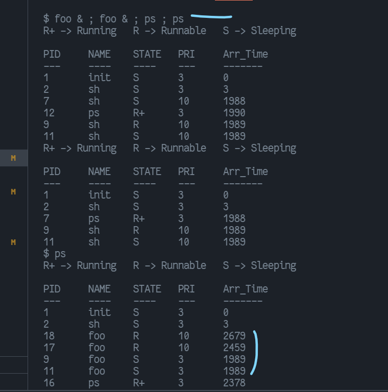

# OS-Assignment 2

OS-assignment CSE 3

[`Github_Link`](https://github.com/dipankardas011/OS-Assignment)

Submitted to: Sir Amulya Ratna Swain

`Author : Dipankar Das`

```diff
From 6b8669f221d9ec34be24b5861e5039ad4994f788 Mon Sep 17 00:00:00 2001
From: Dipankar Das <dipsonu10@hotmail.com>
Date: Sat, 2 Apr 2022 19:58:47 +0530
Subject: [PATCH 3/3] Done Reviewing the code
MIME-Version: 1.0
Content-Type: text/plain; charset=UTF-8
Content-Transfer-Encoding: 8bit
To: amulyafcs@kiit.ac.in
Cc: 20051554@kiit.ac.in

LGTM 👍🏼

Signed-off-by: Dipankar Das <dipsonu10@hotmail.com>
---
 src/proc.c | 7 +------
 1 file changed, 1 insertion(+), 6 deletions(-)

diff --git a/src/proc.c b/src/proc.c
index 97e9dec..69f8c1a 100644
--- a/src/proc.c
+++ b/src/proc.c
@@ -651,20 +651,15 @@ waitpid(int cpid)
 			p->state = UNUSED;
 			release(&ptable.lock);
 			return pid;
-			
 			}
-		
 		}
 		if(havekids || curproc->killed){
-		
 			release(&ptable.lock);
 			return -1;
-		
 		}
 
 		sleep(curproc, &ptable.lock);
-		
-		}
+	}
 }
 
 
-- 
2.25.1

From 2500744dd14134de885a03ff0304be0227d0420d Mon Sep 17 00:00:00 2001
From: Dipankar Das <dipsonu10@hotmail.com>
Date: Sat, 2 Apr 2022 10:43:43 +0530
Subject: [PATCH 2/3] Added documentation to the scheduling
MIME-Version: 1.0
Content-Type: text/plain; charset=UTF-8
Content-Transfer-Encoding: 8bit
To: amulyafcs@kiit.ac.in
Cc: 20051554@kiit.ac.in

[◍] proc.c

Signed-off-by: Dipankar Das <dipsonu10@hotmail.com>
---
 src/proc.c | 33 +++++++++++++++++++++------------
 1 file changed, 21 insertions(+), 12 deletions(-)

diff --git a/src/proc.c b/src/proc.c
index 9cc4f15..97e9dec 100644
--- a/src/proc.c
+++ b/src/proc.c
@@ -319,17 +319,19 @@ wait(void)
  * Scheduler never returns.  It loops, doing:
  * What it does:
  * * there is Time Quantum {Round Robin} --predefined--
- * * choose a process to run from the ready queue which has the
- *    highest priority {Priority based} `RUNNABLE`
+ * * choose a process to run from the ready queue which has:
+ *  * * the highest priority {Priority based} `RUNNABLE`
+ *  * * if same PRI then decide using the Arrival time {FCFS}
  * * swtch to start running that process
- * * eventually that process transfers control
- *    via swtch back to the scheduler.
+ * * eventually that process transfers control via swtch back to the scheduler.
  * 
  * @how it accomplishes
  * as the process are push according to there creation it is already FCFS
  * then we select based on the highest priority becomes Priority based
  * finally as we are preempting the process according to the Quantum Time
  *    it is becomming the Round Robin Sched.
+ * TODO: 
+ * * to implement Ageing in this scheduling
  */
 
 void
@@ -346,13 +348,19 @@ scheduler(void)
     sti();
 
     struct proc *highPri = 0;
-    // Loop over process table looking for process to run.
     acquire(&ptable.lock);
+    // N = number of process which are 'RUNNABLE'
+    // then O(N^2) is the algorithm to decide which one to pick
+    
     for(p = ptable.proc; p < &ptable.proc[NPROC]; p++){
       if(p->state != RUNNABLE)
         continue;
 
       highPri = p;
+      /**
+       * if one process which is runnable is selected @param highPri
+       * then it take {N} steps to get the best fit process
+       */
 
       for (p1 = ptable.proc; p1 < &ptable.proc[NPROC]; p1++) {
         if (p1->state != RUNNABLE) 
@@ -360,14 +368,16 @@ scheduler(void)
 
         if (p1->priority < highPri->priority)
           highPri = p1;
-        if (p1->priority == highPri->priority && p1->cr_time < highPri->cr_time) 
+
+        // if the Priority based decision is not helping then we are deciding using the
+        // FCFS based method of determination i.e. which one came first
+        if (p1->priority == highPri->priority && p1->cr_time < highPri->cr_time)
           highPri = p1;
       }
 
       p = highPri;
-      // Switch to chosen process.  It is the process's job
-      // to release ptable.lock and then reacquire it
-      // before jumping back to us.
+      // Switch to chosen process.  It is the process's job to release ptable.
+      // lock and then reacquire it before jumping back to us.
       c->proc = p;
       switchuvm(p);
       p->state = RUNNING;
@@ -375,8 +385,6 @@ scheduler(void)
       swtch(&(c->scheduler), p->context);
       switchkvm();
 
-      // Process is done running for now.
-      // It should have changed its p->state before coming back.
       c->proc = 0;
     }
     release(&ptable.lock);
@@ -593,7 +601,8 @@ sys_sps(void)
   struct proc *p;
   sti();
   acquire(&ptable.lock);
-  cprintf("R+ -> Running\tR -> Runnable\tS -> Sleeping\n\nPID\tNAME\tSTATE\tPRI\tArr_Time\n---\t----\t----\t---\t-------\n");
+  cprintf("R+ -> Running\tR -> Runnable\tS -> Sleeping\n");
+  cprintf("\nPID\tNAME\tSTATE\tPRI\tArr_Time\n---\t----\t----\t---\t-------\n");
   for(p = ptable.proc; p<&ptable.proc[NPROC]; p++) {
     if (p->pid < 1) 
       continue;
-- 
2.25.1

From 99085a0d03f802c957488111e742ccbe3cd787dd Mon Sep 17 00:00:00 2001
From: Dipankar Das <dipsonu10@hotmail.com>
Date: Wed, 30 Mar 2022 17:18:31 +0530
Subject: [PATCH 1/3] Done with the modified Scheduler
MIME-Version: 1.0
Content-Type: text/plain; charset=UTF-8
Content-Transfer-Encoding: 8bit
To: amulyafcs@kiit.ac.in
Cc: 20051554@kiit.ac.in

[+] foo
[◍] proc where Round Robin is modified with the Priority Based
	referenced NOTES/paper.pdf
[+] Output

Signed-off-by: Dipankar Das <dipsonu10@hotmail.com>
---
 output/Q5.png | Bin 0 -> 81066 bytes
 src/Makefile  |   3 +-
 src/defs.h    |   2 +-
 src/exec.c    |   3 ++
 src/foo.c     |  31 ++++++++++++++++
 src/param.h   |   3 +-
 src/proc.c    | 100 +++++++++++++++++++++++++++++++++++++-------------
 src/proc.h    |   3 +-
 src/ps.c      |   2 +-
 src/syscall.c |   2 +-
 src/sysproc.c |   5 ---
 11 files changed, 118 insertions(+), 36 deletions(-)
 create mode 100644 output/Q5.png
 create mode 100644 src/foo.c

diff --git a/output/Q5.png b/output/Q5.png
new file mode 100644
index 0000000000000000000000000000000000000000..cce95a5a588baa746cccbe667efb96aeec80b0e7
GIT binary patch
literal 81066
zcmdR$WmJ@J+wKVgB}JsWr9(mKkOl$i21!9WM1}?tkOt|L?q<j#L<A&;4u_PXJBFTN
z-#pL%+56q^x4qZeANH)pV(#Idy6)?`&htEu-$|sVx*`EC6)qYY8iBHsoE91y#w8jW
zCfY-6;E}iANSJ|N=pI^%vS`(#G~2+z13Q^FGH7UZad@}yuz=%7u1ba;XlP`t_dn>$
zS}aFsXm>@*axyxf%=VC*-o}b;!hU8Cy0bh+({%`SQj%>9Q?%Rt_aql3{XwIrl{to|
z`$)`<VZSUPdb<(O3^fR`y}9pt-MHv%SYO3$Y?v>{shQ8Rk>$ZAt-gpA#KfV3Asxij
..................................................................
z%9=YgJJEA(RRpnFKM|P2G`(iYjS4+M(`*dRDtC@=6MZ-X7bgPTG$A7;lW*ZmfjLJE
zz)54pO_N=nW+c8tTDT6Z75qUE5PbWATy*ROO3SK4Swgck;Qjn~o?6HF`2w&N0S$~t
zV_#L&y}CexiTY&$IP!-N#3#}+(&GR9L&VPqXw8iSrZ<sVSmoY`b?WP`>cF)tt~f;g
E3w$@ZuK)l5

literal 0
HcmV?d00001

diff --git a/src/Makefile b/src/Makefile
index e4085bf..9824ff6 100644
--- a/src/Makefile
+++ b/src/Makefile
@@ -185,6 +185,7 @@ UPROGS=\
 	_zombie\
 	_myprocess\
 	_cal\
+	_foo\
 
 fs.img: mkfs README $(UPROGS)
 	./mkfs fs.img README $(UPROGS)
@@ -254,7 +255,7 @@ qemu-nox-gdb: fs.img xv6.img .gdbinit
 EXTRA=\
 	mkfs.c ulib.c user.h cat.c echo.c forktest.c grep.c kill.c\
 	ln.c ls.c mkdir.c rm.c stressfs.c usertests.c wc.c prd.c zombie.c\
-	printf.c umalloc.c myprocess.c\
+	printf.c umalloc.c myprocess.c foo.c\
 	README dot-bochsrc *.pl toc.* runoff runoff1 runoff.list\
 	.gdbinit.tmpl gdbutil\
 
diff --git a/src/defs.h b/src/defs.h
index d902698..fcaa2a9 100644
--- a/src/defs.h
+++ b/src/defs.h
@@ -122,7 +122,7 @@ void            wakeup(void*);
 void            yield(void);
 int             getppid(void);
 int		          sps(void);
-int 		    waitpid(int);
+int 		        waitpid(int);
 // swtch.S
 void            swtch(struct context**, struct context*);
 
diff --git a/src/exec.c b/src/exec.c
index b40134f..a175e8b 100644
--- a/src/exec.c
+++ b/src/exec.c
@@ -99,6 +99,9 @@ exec(char *path, char **argv)
   curproc->sz = sz;
   curproc->tf->eip = elf.entry;  // main
   curproc->tf->esp = sp;
+  
+  curproc->priority = 3;
+
   switchuvm(curproc);
   freevm(oldpgdir);
   return 0;
diff --git a/src/foo.c b/src/foo.c
new file mode 100644
index 0000000..f7adb3a
--- /dev/null
+++ b/src/foo.c
@@ -0,0 +1,31 @@
+#include "types.h"
+#include "stat.h"
+#include "user.h"
+#include "fcntl.h"
+
+
+int main(int argc, char *argv[]) {
+  int k, n = 3, id;
+  double x = 0, z, d = 1.0;
+
+  id = 0;
+  for (k = 0; k < n; k++) {
+    id = fork();
+    if (id < 0) {
+      //printf(1, "%d failed in fork!\n", getpid());
+      exit();
+    }
+    if (id > 0) {
+      //printf(1, "Parent %d creating child %d\n",getpid(), id);
+      wait();
+    } else {
+      //printf(1, "Child %d created\n",getpid());
+
+      for (z = 0; z < 80000000.00; z += d)
+        x = x + 3.14 * 89.64;  // useless calculation
+      break;
+    }
+  }
+  
+  exit();
+}
diff --git a/src/param.h b/src/param.h
index a7e90ef..621b741 100644
--- a/src/param.h
+++ b/src/param.h
@@ -1,6 +1,7 @@
 #define NPROC        64  // maximum number of processes
 #define KSTACKSIZE 4096  // size of per-process kernel stack
-#define NCPU          8  // maximum number of CPUs
+//#define NCPU          8  // maximum number of CPUs
+#define NCPU          1  // maximum number of CPUs
 #define NOFILE       16  // open files per process
 #define NFILE       100  // open files per system
 #define NINODE       50  // maximum number of active i-nodes
diff --git a/src/proc.c b/src/proc.c
index a87573d..9cc4f15 100644
--- a/src/proc.c
+++ b/src/proc.c
@@ -88,7 +88,7 @@ allocproc(void)
 found:
   p->state = EMBRYO;
   p->pid = nextpid++;
-
+  p->priority = 10;
   release(&ptable.lock);
 
   // Allocate kernel stack.
@@ -313,18 +313,31 @@ wait(void)
   }
 }
 
-//PAGEBREAK: 42
-// Per-CPU process scheduler.
-// Each CPU calls scheduler() after setting itself up.
-// Scheduler never returns.  It loops, doing:
-//  - choose a process to run
-//  - swtch to start running that process
-//  - eventually that process transfers control
-//      via swtch back to the scheduler.
+/**
+ * @def scheduler - Per-CPU process scheduler.
+ * Each CPU calls scheduler() after setting itself up.
+ * Scheduler never returns.  It loops, doing:
+ * What it does:
+ * * there is Time Quantum {Round Robin} --predefined--
+ * * choose a process to run from the ready queue which has the
+ *    highest priority {Priority based} `RUNNABLE`
+ * * swtch to start running that process
+ * * eventually that process transfers control
+ *    via swtch back to the scheduler.
+ * 
+ * @how it accomplishes
+ * as the process are push according to there creation it is already FCFS
+ * then we select based on the highest priority becomes Priority based
+ * finally as we are preempting the process according to the Quantum Time
+ *    it is becomming the Round Robin Sched.
+ */
+
 void
 scheduler(void)
 {
   struct proc *p;
+  struct proc *p1;
+
   struct cpu *c = mycpu();
   c->proc = 0;
   
@@ -332,12 +345,26 @@ scheduler(void)
     // Enable interrupts on this processor.
     sti();
 
+    struct proc *highPri = 0;
     // Loop over process table looking for process to run.
     acquire(&ptable.lock);
     for(p = ptable.proc; p < &ptable.proc[NPROC]; p++){
       if(p->state != RUNNABLE)
         continue;
 
+      highPri = p;
+
+      for (p1 = ptable.proc; p1 < &ptable.proc[NPROC]; p1++) {
+        if (p1->state != RUNNABLE) 
+          continue;
+
+        if (p1->priority < highPri->priority)
+          highPri = p1;
+        if (p1->priority == highPri->priority && p1->cr_time < highPri->cr_time) 
+          highPri = p1;
+      }
+
+      p = highPri;
       // Switch to chosen process.  It is the process's job
       // to release ptable.lock and then reacquire it
       // before jumping back to us.
@@ -541,26 +568,49 @@ getppid()
   return myproc()->parent->pid;
 }
 
+// int
+// sys_sps(void)
+// {
+//   struct proc *p;
+//   sti();
+//   acquire(&ptable.lock);
+//   cprintf("PID : PPID : NAME : STATE : CREATE_TIME : SIZE : PRI\n");
+//   for(p = ptable.proc; p<&ptable.proc[NPROC]; p++) {
+//     if(p->state == SLEEPING)
+//       cprintf("%d : %d : %s : SLEEPING : %d : %d : %d\n",p->pid,p->parent->pid,p->name,p->cr_time,p->sz, p->priority);
+//     else if(p->state == RUNNING)
+//       cprintf("%d : %d : %s : RUNNING : %d : %d : %d\n",p->pid,p->parent->pid,p->name,p->cr_time,p->sz, p->priority);
+//     else if (p->state == RUNNABLE)
+//       cprintf("%d : %d : %s : RUNNABLE : %d : %d : %d\n",p->pid,p->parent->pid,p->name,p->cr_time,p->sz, p->priority);
+//   }
+//   release(&ptable.lock);
+//   return 0;
+// }
+
 int
 sys_sps(void)
 {
-        struct proc *p;
-        sti();
-        acquire(&ptable.lock);
-        cprintf("PID : PPID : NAME : STATE : CREATION TIME : SIZE\n");
-        for(p = ptable.proc; p<&ptable.proc[NPROC]; p++)
-        {
-         if(p->state == SLEEPING)
-         cprintf("%d : %d : %s : SLEEPING : %d : %d\n",p->pid,p->parent->pid,p->name,p->cr_time,p->sz);
-         else if(p->state == RUNNING)
-         cprintf("%d : %d : %s : RUNNING : %d : %d\n",p->pid,p->parent->pid,p->name,p->cr_time,p->sz);
-         else if (p->state == RUNNABLE)
-         cprintf("%d : %d : %s : RUNNABLE : %d : %d\n",p->pid,p->parent->pid,p->name,p->cr_time,p->sz);
-        }
-        release(&ptable.lock);
-        return 0;
-
+  struct proc *p;
+  sti();
+  acquire(&ptable.lock);
+  cprintf("R+ -> Running\tR -> Runnable\tS -> Sleeping\n\nPID\tNAME\tSTATE\tPRI\tArr_Time\n---\t----\t----\t---\t-------\n");
+  for(p = ptable.proc; p<&ptable.proc[NPROC]; p++) {
+    if (p->pid < 1) 
+      continue;
+    char *ch = {'\0'};
+    if (p->state == SLEEPING)
+      ch = "S";
+    else if (p->state == RUNNING)
+      ch = "R+";
+    else if (p->state == RUNNABLE)
+      ch = "R";
+    cprintf("%d\t%s\t%s\t%d\t%d\n", p->pid, p->name, ch, p->priority,p->cr_time);
+  }
+  release(&ptable.lock);
+  return 0;
 }
+
+
 int 
 waitpid(int cpid)
 {
diff --git a/src/proc.h b/src/proc.h
index c1b2d56..13a949e 100644
--- a/src/proc.h
+++ b/src/proc.h
@@ -49,7 +49,8 @@ struct proc {
   struct file *ofile[NOFILE];  // Open files
   struct inode *cwd;           // Current directory
   char name[16];               // Process name (debugging)
-  int cr_time;	 	       //Process creation time
+  int cr_time;	 	             // Process creation time
+  int priority;                // Process Priority
 };
 
 // Process memory is laid out contiguously, low addresses first:
diff --git a/src/ps.c b/src/ps.c
index 21d1679..492662a 100644
--- a/src/ps.c
+++ b/src/ps.c
@@ -5,7 +5,7 @@
 
 int main(void)
 {
-	printf(1,"20051575\n");
+	// printf(1,"20051575\n");
 	sps();
 	/*int t = fork();
 	if(t==0){
diff --git a/src/syscall.c b/src/syscall.c
index 0f35f40..f829241 100644
--- a/src/syscall.c
+++ b/src/syscall.c
@@ -131,7 +131,7 @@ static int (*syscalls[])(void) = {
 [SYS_close]   sys_close,
 [SYS_getppid] sys_getppid,
 [SYS_sps]     sys_sps,
-[SYS_waitpid]   sys_waitpid,
+[SYS_waitpid] sys_waitpid,
 };
 
 void
diff --git a/src/sysproc.c b/src/sysproc.c
index 8a4d3d8..ca252e0 100644
--- a/src/sysproc.c
+++ b/src/sysproc.c
@@ -43,17 +43,12 @@ sys_getpid(void)
 }
 
 
-//-------------------------------
-
 int
 sys_getppid(void)
 {
   return getppid();
-  //return myproc()->parent->pid;
 }
 
-//-------------------------------
-
 int
 sys_sbrk(void)
 {
-- 
2.25.1

```
